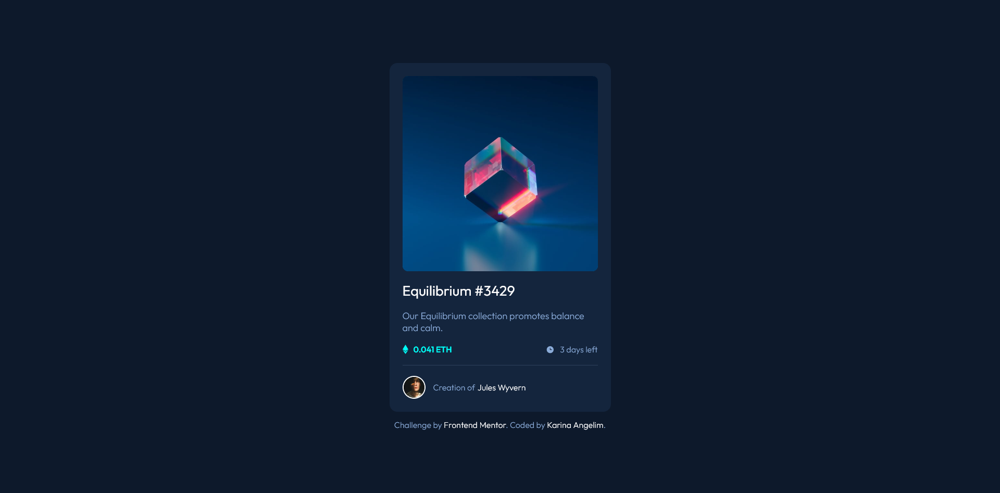

# Frontend Mentor - NFT preview card component solution

This is a solution to the [NFT preview card component challenge on Frontend Mentor](https://www.frontendmentor.io/challenges/nft-preview-card-component-SbdUL_w0U). Frontend Mentor challenges help you improve your coding skills by building realistic projects.

## Table of contents

- [Overview](#overview)
  - [The challenge](#the-challenge)
  - [Screenshot](#screenshot)
  - [Links](#links)
- [My process](#my-process)
  - [Built with](#built-with)
  - [What I learned](#what-i-learned)
- [Author](#author)
- [Acknowledgments](#acknowledgments)

## Overview

### The challenge

Users should be able to:

- View the optimal layout depending on their device's screen size
- See hover states for interactive elements

### Screenshot

### Links

- Solution URL: [Add solution URL here](https://your-solution-url.com)
- Live Site URL: [Add live site URL here](https://your-live-site-url.com)

## My process

The first thing I did after downloading the project files was to create the basic structure of the page with HTML. When I had all the elements in place, I proceeded to create the CSS styles, from top to bottom.

### Built with

- Semantic HTML5 markup
- CSS custom properties
- Flexbox
- CSS Grid
- Mobile-first workflow
- Atom (code editor)

### What I learned

This project helped me understand and practice the use of CSS Flexbox and Grid properties for coding mobile-first websites. Using these techniques helped me save time when building the mobile page, as I only had to adjust a few details like the spacing on the top of the page.

## Author

- Website - [Dev.to Blog](https://dev.to/akarinaa)
- Frontend Mentor - [@akarinaa](https://www.frontendmentor.io/profile/akarinaa)
